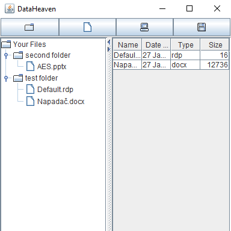
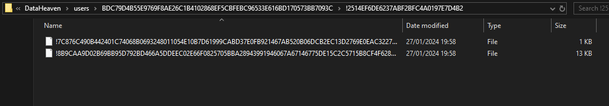

# DataHeaven
A safe place for your data.



### Table of Contents
1. Introduction
2. Features
3. Installation
4. Usage
5. License
## Introduction
DataHeaven is a project focused on the encryption of files within a local system. The primary goal of this project is to enable secure encryption and decryption of files, preventing unauthorized access to anyone without the proper login credentials. The concept is designed to keep the user's identity private when uploading files.
## Features
1. SHA-256-based registration and login system, ensuring the utmost protection for your credentials, even in shared computing environments.
2. Exploration of your private files, providing a user experience reminiscent of the familiarity found in Windows Explorer.
3. Enjoy an enriched file management experience with features like 'Add Folder,' 'Add File,' 'Delete,' 'Decrypt,' and 'Download,' seamlessly integrated into the file panel.
## Installation
```bash
git clone https://github.com/Aleks4k/DataHeaven.git
```
## Usage
```bash
java -jar DataHeaven.jar
```
## License
Distributed under the Apache License. See LICENSE.txt for more information.
